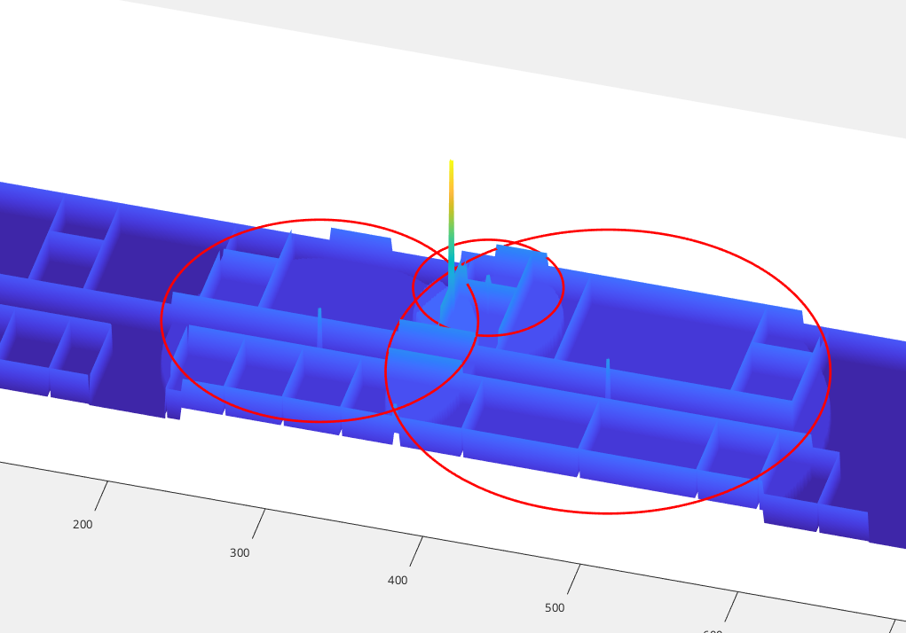

# Trilateration using WiFi

A real-time indoor location tracking system developed using ESP32 microcontrollers and the IIT Roorkee Wi-Fi network. The system estimates the position of a device based on RSSI values from known Wi-Fi access points (routers) and applies trilateration techniques in MATLAB for localization.

To have a detailed analysis, have a look at the [Project Report](./ECT_104_Final_report.pdf).

The contents of [main.m](./main.m) have segregated into [floor_plan.m](./individual_sections/floor_plan.m), [prediction.m](./individual_sections/prediction.m) and [RSSI_average.m](./individual_sections/RSSI_average.m) to represent the order in which this project was developed. 

## Run the system

1. Flash an ESP-32 with `reciever.ino` after replacing with actual MAC addresses and SSID.

2. Connect the ESP to you laptop via a serial port and start `main.m` in MATLAB. Make to accordingly change the serial port name with respect to your laptop.

3. To get results of error analysis of the testing that we conducted run the [error_analysis.m](./error_analysis.m).

## Modify the system for a new location

1. To set up this code for a new location, the similar floor plan simulation to [floor_plan.m](./individual_sections/floor_plan.m) must be created to replace code in section 3.2 of the [Project Report](./ECT_104_Final_report.pdf).

2. To accuratly approximate the location of the device for a new location, regular readings of RSSI values using the ESP-32 at interval of 5 meters must be taken and fed into `pathloss.m` to determine the actual pathloss functions for the new location and the code in section 3.5 of the [Project Report](./ECT_104_Final_report.pdf) must be correctly updated with the new loss functions.

3. Update [error_analysis.m](./error_analysis.m) with the respective 2D floor plan and experimentally achieved values to perform analysis for a new location.

<strong>Centroid of the Common Region</strong>

Made with ❤️ by Kunal and Dakshveer

